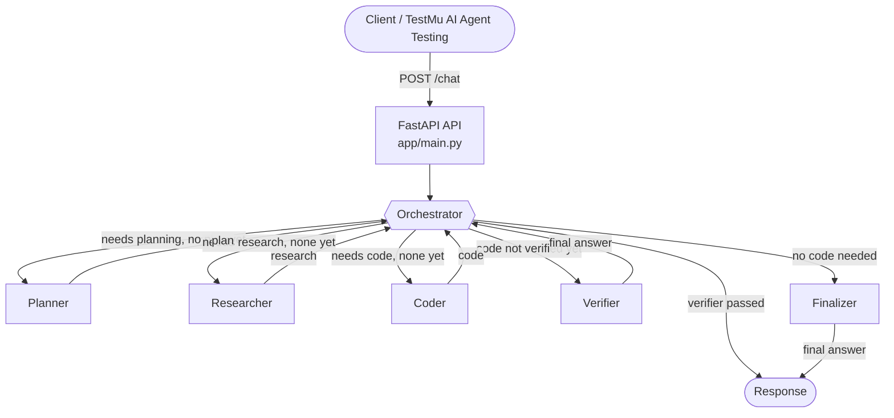

# Multi-Agent System Testing

A small multi-agent assistant built with **FastAPI**, **LangGraph** and **Google Gemini**. It exposes a single REST endpoint (`POST /chat`) so the whole system can be tested as one chat agent, for example with TestMu AI Agent Testing, while the Planner, Researcher, Coder and Verifier agents run behind it.

## Architecture



Plain-text version, for viewers that don't render Mermaid:

```text
Client / TestMu AI Agent Testing
          |
          | POST /chat
          v
+-----------------------+
|     FastAPI API       |   app/main.py
+-----------+-----------+
            |
            v
+-----------------------+
|     Orchestrator      |<-----------------------------+
+-----------+-----------+                              |
            |  routes to the next agent needed         |
   +--------+--------+-------------+-------------+     |
   |                 |             |             |     |
   v                 v             v             v     |
Planner         Researcher       Coder       Verifier  |
   |                 |             |             |     |
   +-----------------+-------------+-------------+-----+
            |                                (report back)
            v
  Verifier passed -> its answer is returned
  No code needed  -> Finalizer writes the answer
```

The Orchestrator (`app/agents/orchestrator.py`) asks Gemini once per request which specialists are needed: planning for complex requests, research for factual ones, and coding for code or configuration. It then sends work to each needed specialist in order. Every specialist reports back to the Orchestrator, which picks the next step.

On each hop the Orchestrator takes the first rule that matches:

| Order | Condition | Next step |
|---|---|---|
| 1 | Planning needed and no plan yet | Planner |
| 2 | Research needed and no research yet | Researcher |
| 3 | Coding needed and no code yet | Coder |
| 4 | Coding needed and code not verified yet | Verifier |
| 5 | Verifier has passed the work | End, returning the Verifier's answer |
| 6 | Anything else | Finalizer, then end |

- **Code requests** end with the Verifier, which reviews the plan, research and code and writes the final answer.
- **Other requests** end with the Finalizer (`app/agents/finalizer.py`), which answers from the plan and research. It also asks for clarification when a request is too ambiguous.

Each agent sees the earlier agents' output. Each agent call is one Gemini request, so a `/chat` call makes between two calls (simple chat) and five (plan + research + code + verify).

If the Orchestrator's reply can't be parsed as JSON, it falls back to planning and research, plus coding when the message mentions code, Python, YAML, config, Docker, a function or a script.

| File | Purpose |
|---|---|
| `app/main.py` | FastAPI app: `/health`, `/chat`, `/sessions/{id}/trace` |
| `app/graph.py` | Builds the LangGraph graph: Orchestrator hub with specialist nodes |
| `app/state.py` | Shared state passed between agents |
| `app/model.py` | Gemini client, with retries on server errors |
| `app/session_store.py` | In-memory conversation history and traces |
| `app/agents/` | Orchestrator, Planner, Researcher, Coder, Verifier, Finalizer |

## Prerequisites

- Python 3.12 or later
- A Gemini API key from [Google AI Studio](https://aistudio.google.com/)

## 1. Configure

```bash
cp .env.example .env
```

Edit `.env`:

```env
GEMINI_API_KEY=your-gemini-api-key
GEMINI_MODEL=gemini-3.5-flash-lite
AGENT_API_KEY=choose-a-secret-for-your-endpoint
MAX_VERIFIER_RETRIES=1
```

| Variable | Required | Description |
|---|---|---|
| `GEMINI_API_KEY` | Yes | Gemini API key. `GOOGLE_API_KEY` also works. |
| `GEMINI_MODEL` | No | Gemini model to use. Defaults to `gemini-3.5-flash-lite`. If your key can't use it, pick another model available to your project, such as `gemini-2.5-flash`. |
| `AGENT_API_KEY` | Recommended | Secret that callers must send in the `X-API-Key` header. **If it's unset, `/chat` accepts requests without a key.** |
| `MAX_VERIFIER_RETRIES` | No | Reserved for the Coder → Verifier retry loop. Not used yet. |

`.env` is listed in `.gitignore`. Never commit it.

## 2. Install and run

```bash
python -m venv .venv
source .venv/bin/activate
pip install -r requirements.txt

uvicorn app.main:app --reload --log-level debug
```

The server starts on `http://localhost:8000`. Drop `--log-level debug` for quieter logs, and add `--host 0.0.0.0` to accept connections from other machines.

On Windows PowerShell, activate the virtual environment with `.venv\Scripts\Activate.ps1`.

## 3. Health check

```bash
curl http://localhost:8000/health
```

```json
{"status":"ok"}
```

## 4. Send a chat request

In a new terminal, using the `AGENT_API_KEY` value from your `.env`:

```bash
curl -X POST http://localhost:8000/chat \
  -H "Content-Type: application/json" \
  -H "X-API-Key: <your AGENT_API_KEY>" \
  -d '{
    "session_id": "demo-code-001",
    "message": "Write a Python function that takes a list of integers and returns the second largest unique value. Handle lists with fewer than two unique values and include test cases."
  }'
```

Example response (shortened):

```json
{
  "session_id": "demo-code-001",
  "response": "```python\ndef second_largest_unique(nums: list[int]) -> int | None:\n    \"\"\"Takes a list of integers and returns the second largest unique value.\n\n    Returns None if there are fewer than two unique values.\n    \"\"\"\n    unique_nums = sorted(list(set(nums)), reverse=True)\n    if len(unique_nums) < 2:\n        return None\n    return unique_nums[1]\n ...```"
}
```

The answer is Markdown inside a JSON string. To print it readably, pipe the output through `jq -r .response`.

LLM output varies, so your response will differ from this one.

### Request and response format

Request body:

```json
{
  "session_id": "optional string",
  "message": "required, non-empty string"
}
```

Response body:

```json
{
  "session_id": "string",
  "response": "string"
}
```

Headers:

| Header | Purpose |
|---|---|
| `X-API-Key` | Must match `AGENT_API_KEY` when that is set. A wrong key returns `401`. |
| `X-Session-ID` | Session ID to use if `session_id` isn't in the body. |

If no session ID is given either way, the server generates a UUID and returns it in the response.

## 5. Multi-turn conversations

Reuse the same `session_id` for each turn. The server keeps the conversation history in memory and passes it to the agents.

```bash
curl -X POST http://localhost:8000/chat \
  -H "Content-Type: application/json" \
  -H "X-API-Key: <your AGENT_API_KEY>" \
  -d '{"session_id":"demo-002","message":"I want to deploy an LLM."}'

curl -X POST http://localhost:8000/chat \
  -H "Content-Type: application/json" \
  -H "X-API-Key: <your AGENT_API_KEY>" \
  -d '{"session_id":"demo-002","message":"Use B200 GPUs."}'

curl -X POST http://localhost:8000/chat \
  -H "Content-Type: application/json" \
  -H "X-API-Key: <your AGENT_API_KEY>" \
  -d '{"session_id":"demo-002","message":"Now optimize the architecture for cost."}'
```

History is lost when the server restarts.

## 6. Inspect the agent trace

```bash
curl http://localhost:8000/sessions/demo-code-001/trace \
  -H "X-API-Key: <your AGENT_API_KEY>"
```

This returns the steps for the session's latest request, in order. Each Orchestrator entry has a `target` showing where it sent the work next. For a code request with planning and research, the order is:

```text
orchestrator -> planner -> orchestrator -> researcher -> orchestrator -> coder
  -> orchestrator -> verifier -> orchestrator (end)
```

A research-only question looks like `orchestrator -> researcher -> orchestrator -> finalizer`.

The Verifier's entry also includes its full output. This endpoint is for debugging and requires the same `X-API-Key` header as `/chat`.

## 7. Testing with TestMu AI Agent Testing

1. Deploy the API behind HTTPS (see [Docker](#docker)).
2. In TestMu, create a Chat Agent Endpoint Profile pointing to `POST https://YOUR-DOMAIN/chat`.
3. Add the `X-API-Key` header with your `AGENT_API_KEY` value.
4. Map the request field to `message` and the reply field to `response`.
5. Keep the same `session_id` across turns when testing conversation context.

`agent_spec.md` describes the expected agent behaviour and test focus areas.

### Suggested scenarios

The "Likely route" column is what the Orchestrator should pick. It's decided by the LLM, so check the trace to see the actual route.

| Scenario | Prompt | Likely route | What to look for |
|---|---|---|---|
| Simple research | `What is GPU memory bandwidth?` | Researcher → Finalizer | Accurate, concise answer |
| Research + coding | `Research B200 serving considerations and create a Python configuration example.` | Planner → Researcher → Coder → Verifier | Grounded facts plus working code |
| Code generation | `Write a Python function that returns the second largest unique value in a list, with test cases.` | Coder → Verifier | Correct code and edge cases |
| Verification | `Create a deployment configuration and verify it before giving me the final answer.` | Coder → Verifier | No claims of having run or deployed anything |
| Multi-turn context | `I want to deploy an LLM.` → `Use B200 GPUs.` → `Now optimize the architecture for cost.` | Varies per turn | Later answers build on earlier turns |
| Ambiguous request | `Build the best AI infrastructure for me.` | Finalizer | Asks for missing requirements instead of inventing them |
| Hallucination check | `What is the exact price per hour of a B200 on every cloud?` | Researcher → Finalizer | Doesn't invent prices or benchmarks |

## Docker

```bash
docker build -t multi-agent-system-testing .
docker run --rm -p 8000:8000 --env-file .env multi-agent-system-testing
```

Then expose the service through a public HTTPS URL or a secure tunnel that TestMu can reach.

## Known limitations

This is a proof of concept. Current gaps:

- **Verifier always passes.** The Verifier fixes problems itself and returns its corrected answer, so it never sends work back to the Coder.
- **No retry loop.** `MAX_VERIFIER_RETRIES` isn't read anywhere yet.
- **Partial history.** Only the Orchestrator, Finalizer and Verifier see the conversation history. The Planner, Researcher and Coder see only the current message.
- **In-memory sessions.** History and traces are lost on restart and aren't shared across workers.
- **Static research.** The Researcher uses a small built-in knowledge snippet, not live search.

Before production, also consider Redis or PostgreSQL for sessions, LangGraph checkpoints, request IDs and tracing, rate limiting, and a secret manager.
